# SDS Toolbox - CD with GitHub Actions and AWS

The Software Design School (SDS) Toolbox is a collection of guides and resources to help you get started with the various tools and technologies used in software engineering.

This guide provides a step-by-step walkthrough on how to set up Continuous Deployment (CD) with GitHub Actions and Amazon Web Services (AWS).

## Learning Objectives

Welcome to this guide on Continuous Deployment (CD) with GitHub Actions and Amazon Web Services (AWS). In this guide, you will learn:

- How to manually deploy the backend of the address book app you created previously to AWS environment.
- How to set up a GitHub Actions workflow that automates the deployment process.

## Prerequisites

Before starting, ensure that you have the following:

1. Basic understanding of Git and version control
2. A GitHub account
3. Familiarity with the concepts of CD
4. Node.js and npm installed on your local machine
5. An AWS account (if you don't have one, sign up at <https://aws.amazon.com/>)
6. A MongoDB Atlas account (visit the [Get Started with Atlas](https://www.mongodb.com/docs/atlas/getting-started/) guide to get started with MongoDB Atlas)

## Setup

1. Fork and then clone the [SDS-Kit-CD-GH-AWS-Code](https://github.com/sds-edu/SDS-Kit-CD-GH-AWS-Code) repository to your device.

   > ℹ️ About the project: The repository contains the backend code of an address book application, one that is similar to what you have seen in CS2103/T or CS2113/T but developed in JavaScript. The backend is equipped with basic functionalities, including the ability to add, retrieve, edit, and delete information, by connecting to MongoDB Atlas – a cloud database.

2. Install all dependencies in the project directory:

    ```sh
    npm install
    ```

3. Set up a cloud MongoDB database on MongoDB Atlas and obtain the connection string. Create a copy of the `.env.sample` file and name it `.env`. Update the `MONGO_URI` environment variable inside `.env` to point to the cloud database.

   > ℹ️ If your password contains special characters which leads to a parsing error, you need to encode the URI. You may do so at [here](https://www.urlencoder.org/). For more details, refer to this [guide](https://www.mongodb.com/docs/atlas/troubleshoot-connection/#special-characters-in-connection-string-password).

4. Start the application locally using

    ```sh
    npm start
    ```

   Go to <http://localhost:8080> and you should be able to see “Welcome to Address Book with CD!”.

   You can also use Postman to test CRUD operations on the API locally. By using the cloud database, you are now testing the application in a local deployment scenario without using a local database.

## Part I: Deploying to AWS Elastic Beanstalk

We will first manually deploy the backend of the address book app to AWS Elastic Beanstalk. This will help you understand the deployment process and the different components involved. Then, we will set up GitHub Actions to automate the deployment process.

Amazon Web Services (AWS) is a cloud computing platform that allows developers to run their applications and services in the cloud without managing the underlying infrastructure, making it easier for developers to deploy and manage their applications.

AWS Elastic Beanstalk is a fully managed orchestration service within AWS that makes deploying web applications simple. It handles the complexities of infrastructure setup, scaling, and deployment, allowing developers to focus on writing code.

When you deploy your web application to AWS Elastic Beanstalk, it involves a few important parts:

- **Application**: This is the web application or API that you want to run in the cloud.
- **Environment**: It’s like a configuration/setup that specifies how your application will run on AWS. You can have different environments for testing, staging, or production.
- **EC2** **Instances (Elastic Compute Cloud)**: These are virtual servers in the cloud that host/run your application.
- **S3 Bucket (Simple Storage Service)**: It might be used to store your application’s versions and files.
- **Application Version**: An application version refers to a specific labeled version of your application’s code that you upload, enabling you to roll back to a previous version if needed. Each version points to an S3 object where the deployable application code is stored.
- **Load Balancer**: It helps distribute incoming traffic across multiple EC2 instances for better performance and reliability.
- **Security Groups**: These are like virtual firewalls for EC2 instances and other AWS resources. They control the inbound and outbound traffic for these resources, e.g., permit or deny specific types of traffic based on source and destination IP addresses.
- **IAM Role (Identity and Access Management)**: An IAM role is an identity that has a set of permissions. It is similar to a user, but isn't tied to a specific individual and does not have long-term credentials. Instead, when you assume a role, it provides you with temporary security credentials to access resources.
- **Identity-based policies**: These are JSON documents that define permissions, i.e., specifying which actions can be performed on which AWS resources. Policies are attached to roles to grant specific permissions.

<br>

Now follow these steps to manually deploy the backend of the address book app:

### Step 1. Set Up AWS Account and Elastic Beanstalk

If you haven’t already, sign up for an AWS account at <https://aws.amazon.com>. Once you have your AWS account ready, navigate to the AWS Management Console.

### Step 2. Create an Elastic Beanstalk Application and Environment

**2.1** In the AWS Management Console, search for and navigate to the **Elastic Beanstalk** service. In the navigation bar, choose `Asia Pacific (Singapore)` `ap-southeast-1` as the region. Alternatively, you can use this [direct link](https://ap-southeast-1.console.aws.amazon.com/elasticbeanstalk/home?region=ap-southeast-1#/welcome).

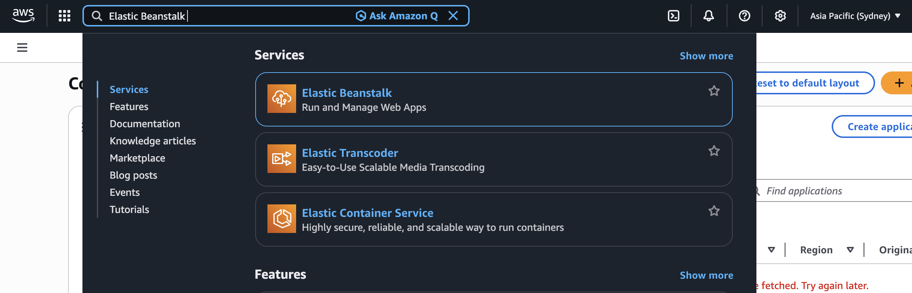

**2.2** Choose **Create application**.

**2.3** Under **Application name**, enter a name for the application (e.g., `AddressBookApp`). The **Environment name** below will be auto-populated.

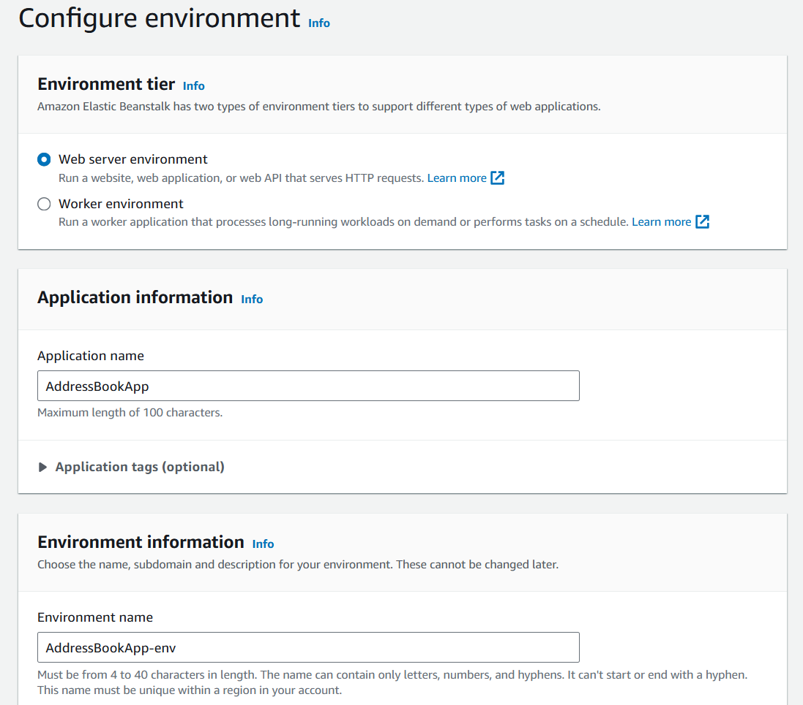

**2.4** Under **Platform**, select **Node.js** as the platform, since our application is built using Node.js.

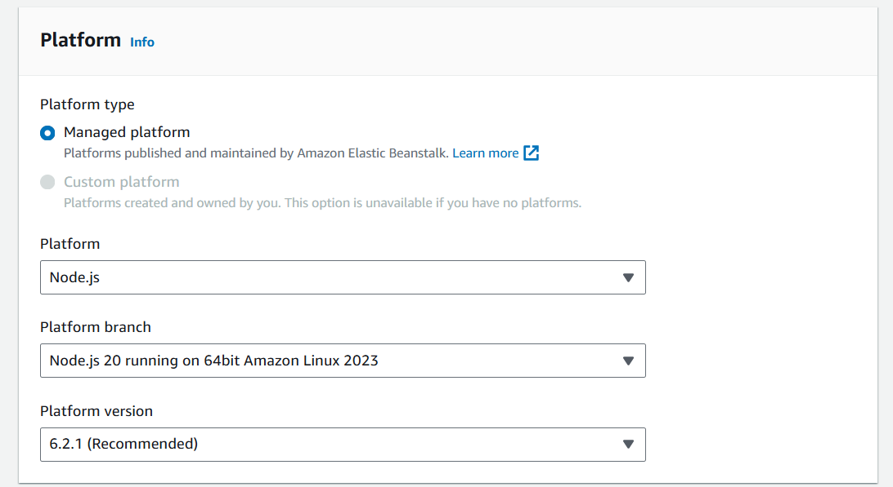

**2.5** Keep the default settings for all other places, then choose **Next**. (Feel free to explore other settings for your own interest 😄)

---

#### Intermission: Configuring Service Access

Now, we are at **Step 2 - Configure service access** in the console. This step requires us to set up some necessary permissions for the application to work properly within AWS. Here’s why it matters:

As an orchestration service, *Elastic Beanstalk* needs to interact with various other AWS services. For example, it manages the creation and operation of EC2 instances (the servers running the app), sets up load balancers, and so on. To do these securely, we need to explicitly grant Elastic Beanstalk the necessary permissions through an *IAM role*, which is called the "**service role**" - essentially, a set of permissions.

On the other hand, the *EC2 instance* also require permissions to perform certain tasks, such as retrieving our application's code (which we will upload later) from S3. We configure these permissions through an "**EC2 instance profile**", which is a wrapper around an IAM role - essentially, another set of permissions.

When you expand the **EC2 instance profile** dropdown, it may be empty. This is expected. In the past, Elastic Beanstalk could automatically create both the service role and the EC2 instance profile when an environment was first launched. Due to updated AWS security guidelines, this behavior has been deprecated. Elastic Beanstalk will no longer create an instance profile for you.

##### Creating an instance profile (mandatory step)

> **⚠️ Important:** Skipping this step will block environment creation. Ensure the role exists and is selected before moving forward.

If you already see the default `aws-elasticbeanstalk-ec2-role` in the list, you can select it and proceed to the next step. Otherwise, you must create a new IAM role and instance profile. To create the required instance profile/IAM role, refer to the steps in the [instance profile](https://docs.aws.amazon.com/elasticbeanstalk/latest/dg/iam-instanceprofile.html#iam-instanceprofile-create), [service profile](https://docs.aws.amazon.com/elasticbeanstalk/latest/dg/iam-servicerole.html#iam-servicerole-create) or follow the steps listed below.

1. From the [create role](https://us-east-1.console.aws.amazon.com/iam/home#/roles/create) page, for **Trusted entity type** select "AWS service".

2. For **Use case** select "Elastic Beanstalk" and "Elastic Beanstalk – Compute". Click "Next".

    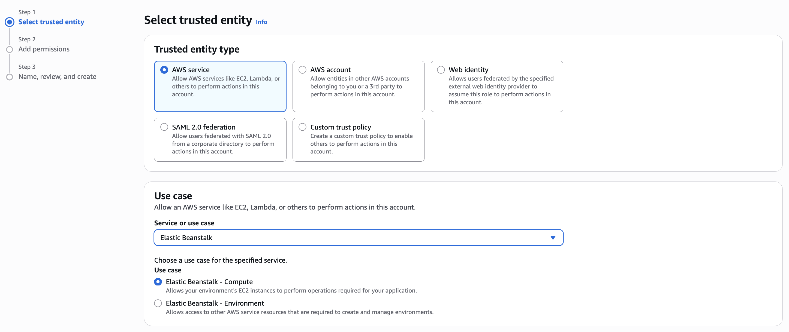

3. Keep all of the 3 default policies recommended for Elastic Beanstalk. Click "Next"

    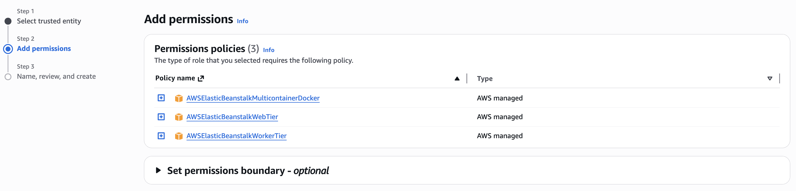

4. You can either use a custom name or stick with the default `"aws-elasticbeanstalk-ec2-role"`. Click "Create role".

    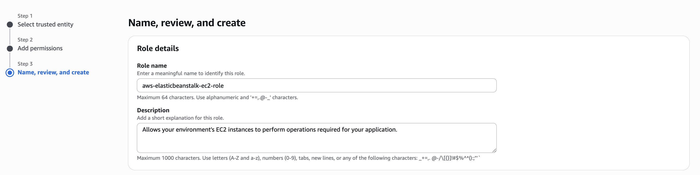

5. Go back to the [create role](https://us-east-1.console.aws.amazon.com/iam/home#/roles/create) page, for **Trusted entity type** select "AWS service".

6. For **Use case** select "Elastic Beanstalk" and "Elastic Beanstalk – Environment". Click "Next".

    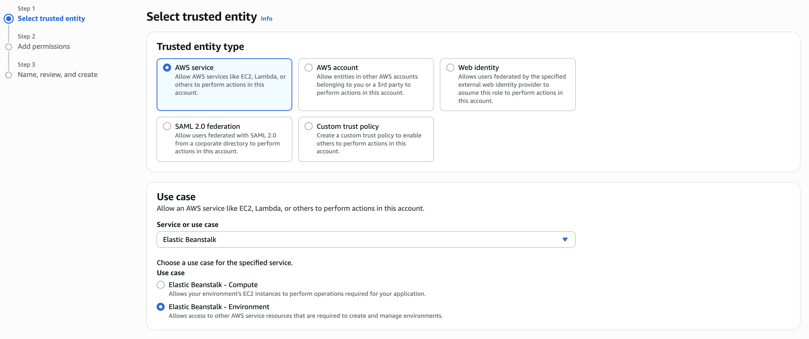

7. Keep both of the default policies recommended for Elastic Beanstalk. Click "Next"

    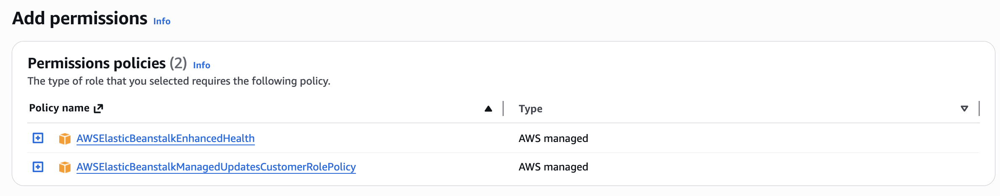

8. You can either use a custom name or stick with the default `"aws-elasticbeanstalk-service-role"`. Click "Create role".

    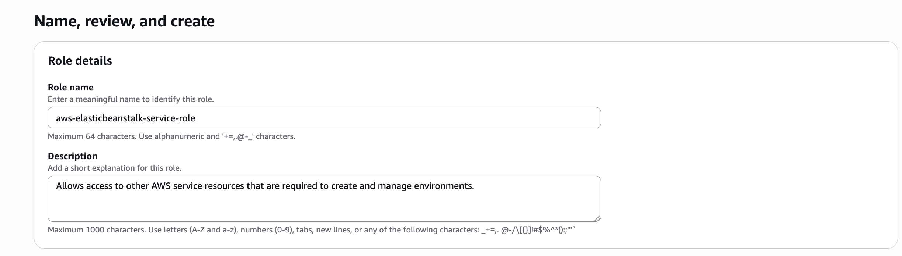

Once you've created the IAM roles, return to **Step 2 - Configure service access**. Refresh the list under **EC2 instance profile**, and you should see the instance profile you just created.

---

**2.6** Under **Service role**, choose the service role you just created (or your existing one if you already had it).

**2.7** Under **EC2 instance profile**, choose the instance profile you just created (or your existing one if you already had it).

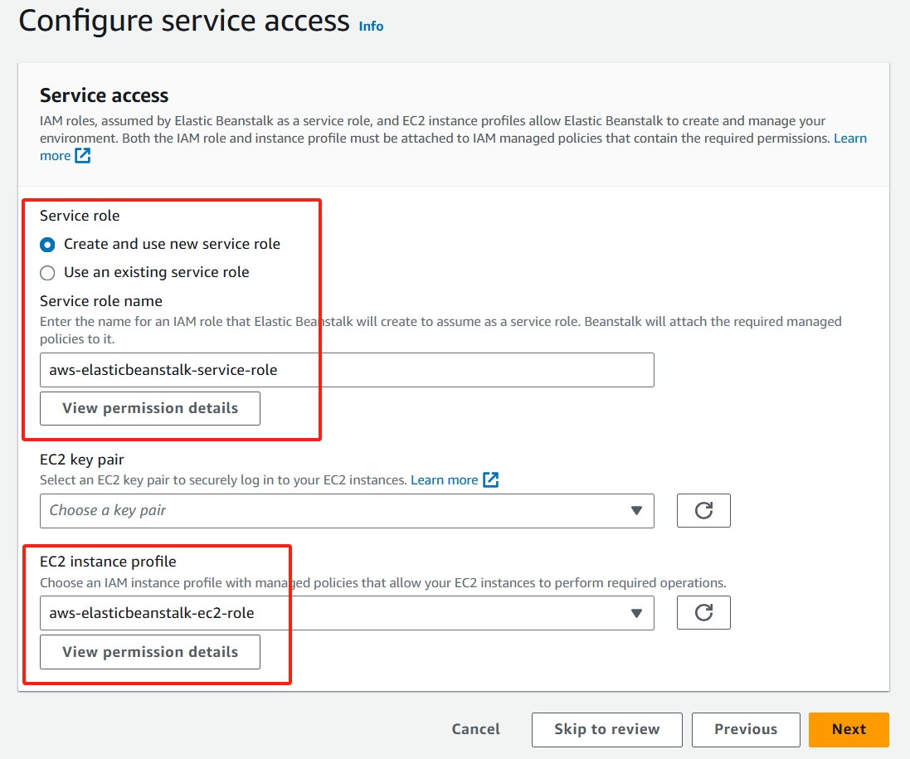

**2.8** We will keep all other settings at their default values. Choose **Skip to review**, and then **Create**. Elastic Beanstalk will now create a new *application* along with a new web server *environment* named `AddressBookApp-env` to run its sample application.

**2.9** Wait for the environment's health status to change to "Ok". This may take a few minutes. Once it’s ready, you can access the sample application at the auto-generated domain.

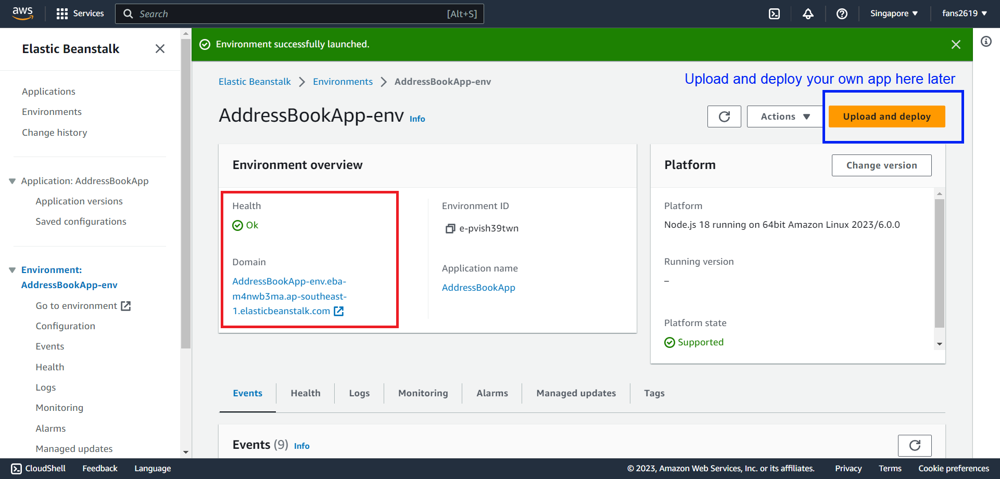

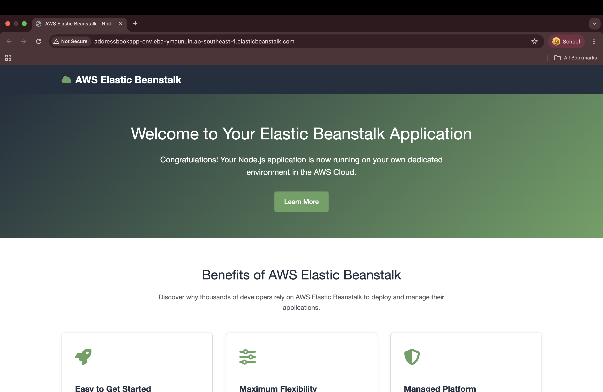

#### Step 3. Prepare Application for Deployment

In your local development environment, create a zip file named `address-book-app.zip` containing all the application files.

- You can omit the `node_modules` folder, as Elastic Beanstalk will install the dependencies in production mode as specified in `package.json`.
- For now, include the `.env` file in the zip, as it contains the cloud database connection string required for the application.
- Elastic Beanstalk determines how to start your Node.js application by reading files located at the root of the ZIP archive. When creating `address-book-app.zip`, make sure you are zipping the contents of the project folder, not the folder itself.
  - Correct ZIP structure:

      ```sh
      address-book-app.zip
      ├── package.json
      ├── package-lock.json
      ├── index.js
      ├── routes/
      ├── controllers/
      ├── models/
      ```

  - Incorrect (will cause deployment failure):

      ```sh
      address-book-app.zip
      └── CS3219-CD-GH-AWS-Code/
          └── package.json
          ├── package-lock.json
          ...
      ```

If Elastic Beanstalk cannot find `package.json` at the ZIP root, it will fail to detect the application start command and the deployment will be aborted—even if a valid `start` script is defined.

> **⚠️ Warning:** In real-world production scenarios, never include your .env file in a zipped deployment. It often contains sensitive secrets and credentials. Instead, configure these as environment variables in the deployment environment (e.g., via AWS Elastic Beanstalk Configuration → Software settings).

While pushing code to GitHub, you can use a `.gitignore` file to exclude the `node_modules` folder and the `.env` file. This ensures that sensitive information is not accidentally shared.

#### Step 4. Deploy Application

**4.1** Return to the AWS Elastic Beanstalk dashboard and navigate to the environment you created earlier.

**4.2** Choose **Upload and deploy**.

**4.3** Upload the zip file you just created. Then in the **Version label** field, enter a version name for this deployment (e.g., `1.0.0`).

**4.4** Choose **Deploy** to start the deployment process.

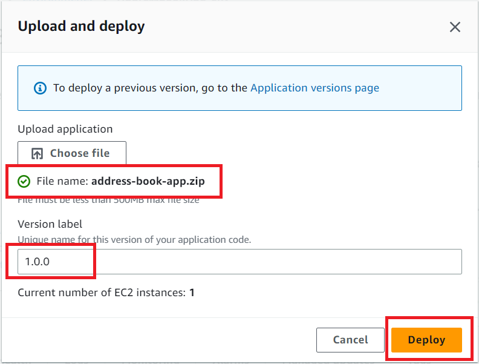

**4.5** Elastic Beanstalk takes care of the rest. Once the deployment is complete, you can visit the environment URL to access the deployed application. Our backend API is now running in the cloud!

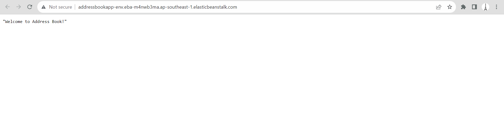

## **Part II: Setting Up GitHub Actions for Automated Deployment**

We will now set up GitHub Actions to automate the deployment process, enabling Continuous Deployment (CD) for our application on AWS Elastic Beanstalk. By doing so, every time changes are pushed to the master branch, GitHub Actions will automatically deploy the updated application to the cloud.

### Step 1: Set Up AWS IAM User and Access Key

For GitHub to interact with AWS services securely, we need to provide the necessary credentials with appropriate permissions.

**1.1** In the AWS Management Console, search for and navigate to the [IAM](https://us-east-1.console.aws.amazon.com/iam/home?region=ap-southeast-1#/home) service.

**1.2** In the IAM console, select **Users** in the left navigation pane and then select **Create user**.

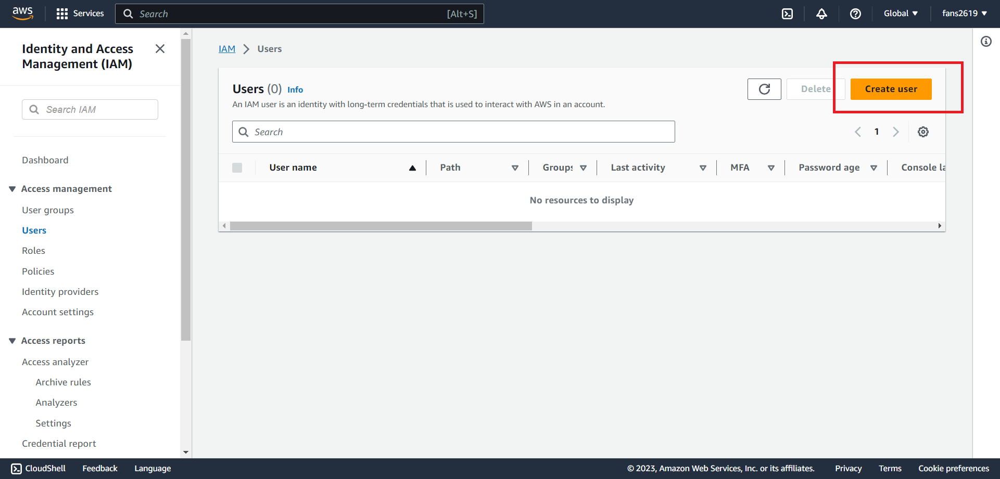

**1.3** Enter a unique username (e.g., `AddressBookDeployUser`) and select **Next**.

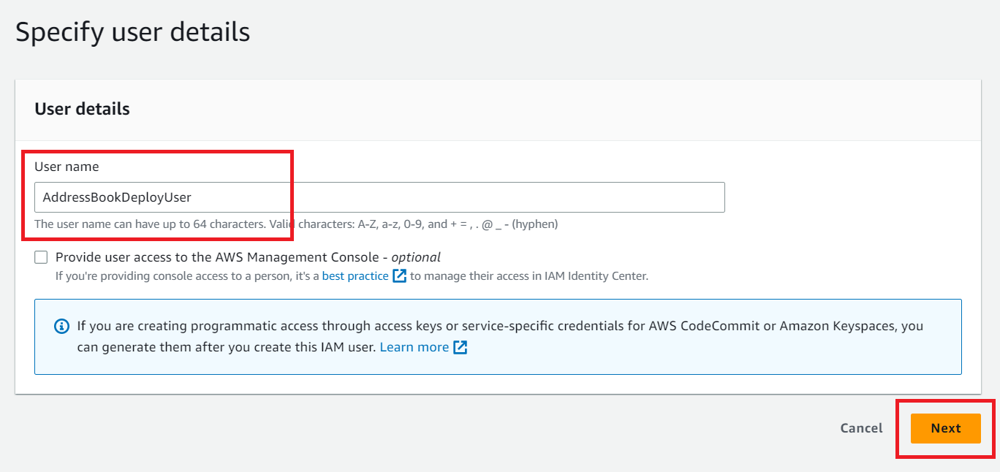

**1.4** In the **Set permissions** section, select **Attach policies directly**, then search for and select `"AdministratorAccess-AWSElasticBeanstalk"` policy. This policy grants the permissions to access the Elastic Beanstalk service. Then choose **Next**, and finally **Create user**.

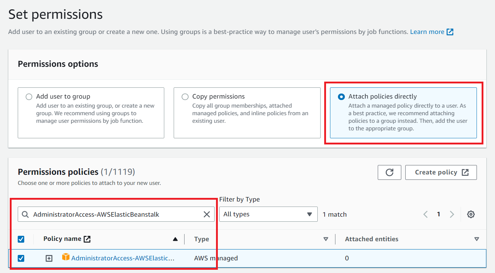

**1.5** After the user is created, navigate to the **Security credentials** tab for the user. Under **Access keys**, choose **Create access key** to generate a new access key for the user. You can select **Other** in the **Access key best practices & alternatives** section.

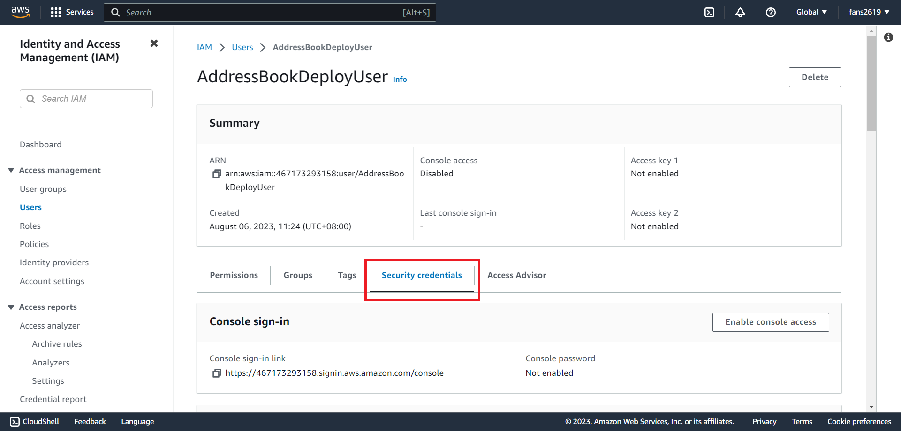

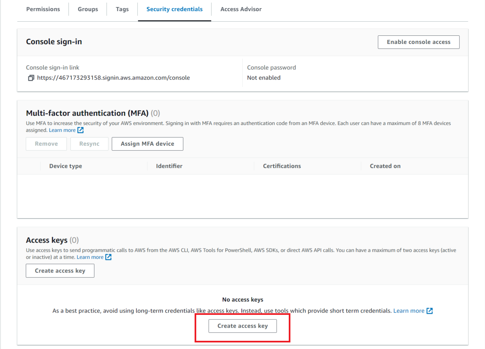

**1.6** In your GitHub repository, navigate to **Settings** >> **Secrets and variables** >> **Actions**. Under **Repository secrets** and add the *Access key* as `AWS_ACCESS_KEY_ID` and the *Secret access key* as `AWS_SECRET_ACCESS_KEY`.

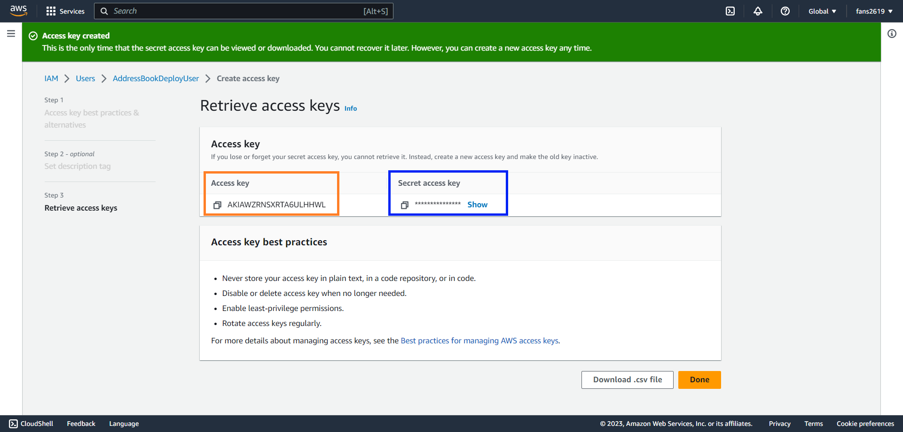

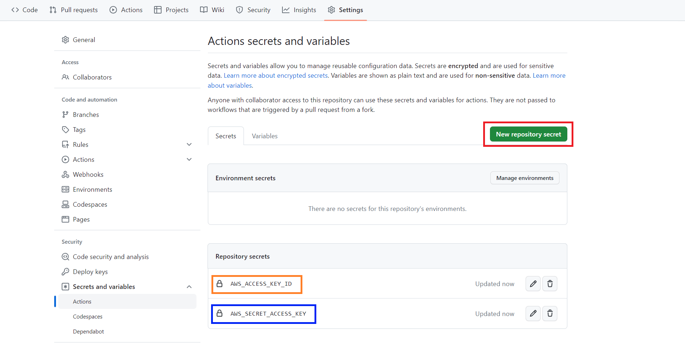

### Step 2: Create an Automated Deployment Workflow

**2.1** Create a `.github` directory in the root of your project

**2.2** Inside the `.github` directory, create another directory named `workflows`

**2.3** Inside the `workflows` directory, create a new file named `cd.yml`

**2.4** Add the following code inside `cd.yml`:

```yaml
name: CD Pipeline

on:
  push:
    branches:
      - master

jobs:
  deploy:
    runs-on: ubuntu-latest

    steps:
      - name: Checkout repository
        uses: actions/checkout@v4

      - name: Setup Node.js
        uses: actions/setup-node@v4
        with:
          node-version: '24.x'
          cache: 'npm'

      - name: Generate deployment package
        run: zip -r address-book-app.zip config controllers models routes index.js package.json

      - name: Get Node.js version
        run: echo "VERSION=$(node -p 'require("./package.json").version')" >> "$GITHUB_ENV"

      - name: Deploy to EB
        uses: einaregilsson/beanstalk-deploy@v22
        with:
          aws_access_key: ${{ secrets.AWS_ACCESS_KEY_ID }}
          aws_secret_key: ${{ secrets.AWS_SECRET_ACCESS_KEY }}
          application_name: AddressBookApp
          environment_name: AddressBookApp-env
          version_label: ${{ env.VERSION }}
          region: ap-southeast-1
          deployment_package: address-book-app.zip
```

<br>

**`name`**: This sets the name of the workflow. In our case, it’s "CD Pipeline".

**`on`**: This specifies the events that trigger the workflow. We use the `push` event on the `master` branch. So, whenever code is pushed to the `master` branch, this workflow will be triggered.

**`jobs`**: This section defines one or more jobs for the workflow. Each job represents a set of steps that run on the same runner. In our case, we have a single job named "deploy".

**`runs-on`**: This specifies the operating system on which the job will run. We use `ubuntu-latest`, which represents the latest version of Ubuntu available on GitHub Actions.

**`steps`**: This section contains a list of steps to be executed in the job. Steps are the individual units of work that run commands or actions.

**`name`**: Each step is given a name to make the output more descriptive and easier to understand.

**`uses`**: This keyword is used to specify an action that should be executed as part of the step. For example, we use the `actions/checkout` to check out the code from the repository and `actions/setup-node` to set up Node.js on the runner.

In the workflow, there are two essential steps. First, we create a deployment package named "address-book-app.zip" by compressing all the necessary application files. Then, we utilize the `beanstalk-deploy` action, which takes care of deploying the correct package to the specified environment with the provided AWS credentials.

The **`with`** section provides input parameters for the `beanstalk-deploy` action:

- **`aws_access_key`** and **`aws_secret_key`** will be automatically fetched from the GitHub repository secrets you added earlier.

- Make sure that **`application_name`** and **`environment_name`** match the ones you are using for your Elastic Beanstalk setup.

- The "Get Node.js version" step fetches the application version from `package.json` and saves it as the GitHub environment variable `VERSION`. The **`version_label`** is then set to the value of `VERSION`, eliminating the need for manual version updates in the workflow file.

### Step 3: Configure Environment Variables in AWS

The final step is to configure the database connection string in Elastic Beanstalk, as it's best practice not to commit sensitive information, like database credentials, to GitHub.

**3.1** In the AWS Management Console, navigate to the Elastic Beanstalk service and select your environment (`AddressBookApp-env`) in the left navigation pane. Ensure the correct region is selected to view your applications and environments.

**3.2** In the navigation pane, choose **Configuration**. This will display all the configurations for the environment.

**3.3** Scroll to the **Updates, monitoring, and logging** category and choose **Edit**.

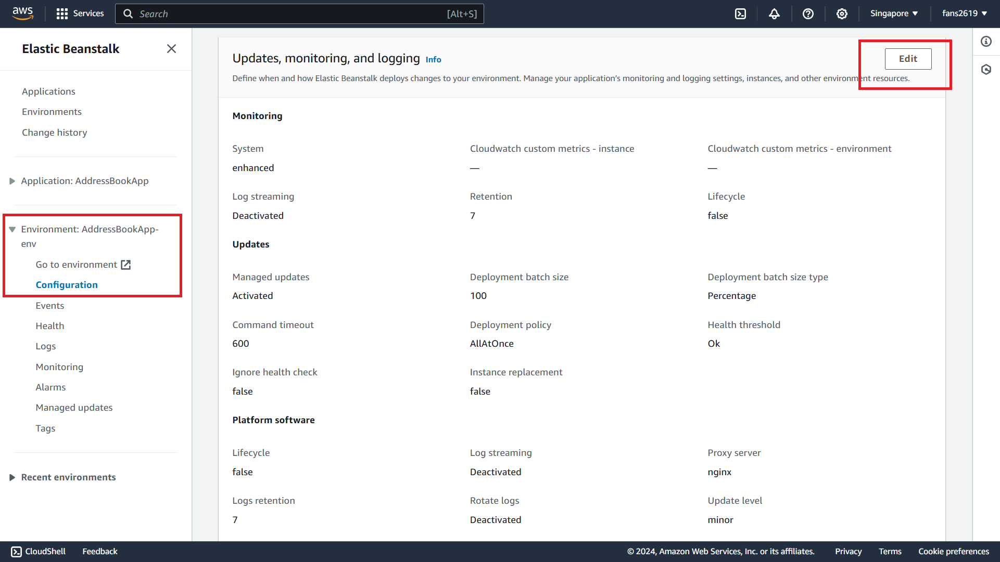

**3.4** Scroll to the bottom and select **Add environment property**.

**3.5** Add your MongoDB Atlas connection string:

- For **Name**, enter `MONGO_URI`
- For **Value**, paste your MongoDB Atlas connection string (the same one from your `.env` file)

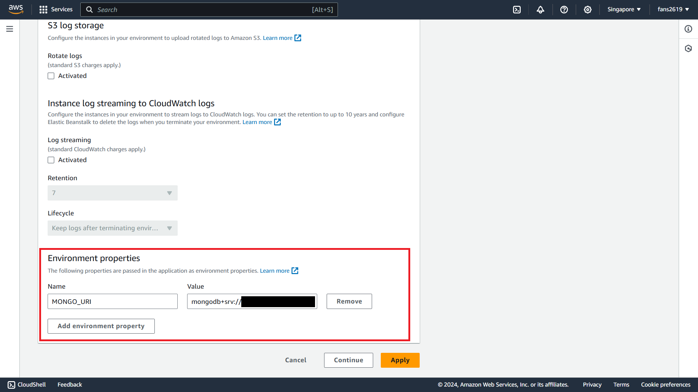

**3.6** Choose "Apply" to save the changes. The environment update may take a while.

### 📖 **Observe CD with GitHub Actions**

1. Make some minor changes to your address book app.
2. Update the version number in `package.json` (e.g., change it to `1.0.1`).
3. Commit and push the changes to the `master` branch of your cloned GitHub repository.
4. Monitor the GitHub Actions workflow and your AWS Elastic Beanstalk environment to verify that the changes are automatically deployed.

<br>

🎉Congratulations on successfully following this CD with GitHub Actions and AWS guide! **Don’t forget to terminate the AWS Elastic Beanstalk environment to avoid unnecessary charges 😊.**

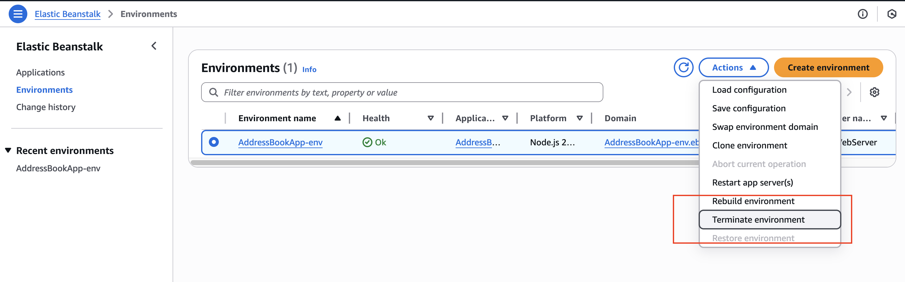

## Part III: Monitoring and Observability with Amazon CloudWatch

Once your application is deployed, it’s important to monitor its performance and availability. **Amazon CloudWatch** is AWS’s observability platform that helps you collect logs, track metrics, create alarms, and get actionable insights from your applications running on AWS.

CloudWatch automatically receives metrics from most AWS services (like EC2, Lambda, Beanstalk), and you can also send your own custom application metrics or logs.

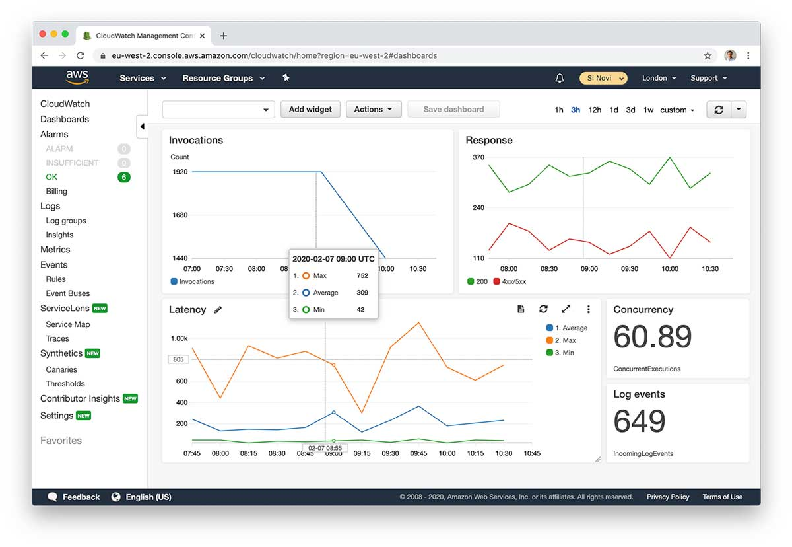

### Logs and Insights

CloudWatch Logs stores your application’s log data. You can use **Log Insights**, a query language similar to SQL, to search and analyze logs quickly.

For example, you can find slow API requests or see how many times a Lambda function ran with specific memory usage.

```sql
fields @timestamp, @message
| filter @message like /Error/
| sort @timestamp desc
| limit 20
```

You can group logs by services like Lambda, ECS, or EC2, and visualize them in one place.

### Dashboards and Metrics

You can create **custom dashboards** that include real-time graphs of application metrics such as:

- Number of invocations
- Errors and latency
- CPU and memory usage
- Request counts or response status codes (e.g., 4xx, 5xx)

These can be useful to spot trends, detect failures, and correlate application issues with system behavior.

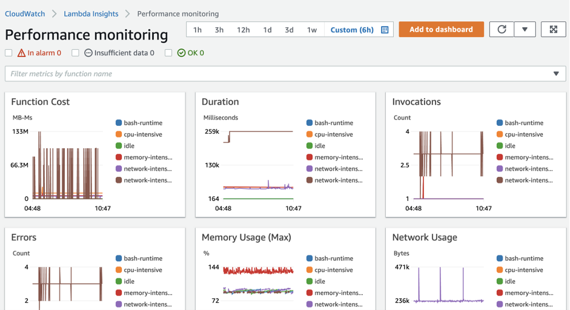

### Alarms and Alerts

CloudWatch Alarms let you define thresholds for metrics and trigger actions (like sending email or triggering a Lambda) when those thresholds are breached.

For example:

- Alert if your application latency exceeds 1 second.
- Alert if memory usage crosses 80%.
- Trigger autoscaling when CPU usage is consistently high.

You can also create **composite alarms** that trigger only when multiple conditions are met (e.g., high latency *and* error rate).

### Synthetic Monitoring

**CloudWatch Synthetics** allows you to simulate user interactions with your app using canaries—automated scripts that run on a schedule.

Use this to monitor:

- API availability and response time
- Health checks of routes or endpoints
- Web UI flows (e.g., login → dashboard → logout)

### Best Practices

- **Set retention policies** for logs to avoid unexpected charges.
- **Use environment variables** to differentiate logs by stage (dev, staging, prod).
- **Avoid excessive logging**—filter logs client-side or at source if possible.
- **Visualize metrics** using dashboards regularly to improve your observability posture.

Monitoring is just as important as deploying. By configuring CloudWatch properly, you gain visibility and peace of mind knowing that your application is behaving as expected—or get notified when it’s not.

---

## References

The following resources were used in the creation of this guide:

- [GitHub Docs - Building and testing Node.js](https://docs.github.com/en/actions/automating-builds-and-tests/building-and-testing-nodejs)

- [AWS Documentation](https://docs.aws.amazon.com/)

- [Managing Elastic Beanstalk instance profiles](https://docs.aws.amazon.com/elasticbeanstalk/latest/dg/iam-instanceprofile.html)

- [AWS Elastic Beanstalk Tutorial](https://youtu.be/jnMUp2c9AzA)

- [MongoDB in GitHub Actions](https://github.com/marketplace/actions/mongodb-in-github-actions)

- [Beanstalk Deploy](https://github.com/marketplace/actions/beanstalk-deploy)
Outline generated with [ChatGPT](https://openai.com/blog/chatgpt)

## Other Resources

- [Using a matrix for your jobs](https://docs.github.com/en/actions/using-jobs/using-a-matrix-for-your-jobs)

- [Using Elastic Beanstalk with Amazon S3](https://docs.aws.amazon.com/elasticbeanstalk/latest/dg/AWSHowTo.S3.html)

- [Deploying an Express application to Elastic Beanstalk using Elastic Beanstalk Command Line Interface (EB CLI)](https://docs.aws.amazon.com/elasticbeanstalk/latest/dg/create_deploy_nodejs_express.html)

- [Deploying to AWS Elastic Beanstalk with GitHub Actions](https://leonardqmarcq.com/posts/github-actions-cicd-elastic-beanstalk)

- [Deploying a Docker application (React) to AWS Elastic Beanstalk](https://akashsingh.blog/complete-guide-on-deploying-a-docker-application-react-to-aws-elastic-beanstalk-using-docker-hub-and-github-actions)

- [Getting started with Elastic Beanstalk](https://docs.aws.amazon.com/elasticbeanstalk/latest/dg/GettingStarted.html)

- [Elastic Beanstalk Service roles, instance profiles, and user policies](https://docs.aws.amazon.com/elasticbeanstalk/latest/dg/concepts-roles.html)

- [Policies and permissions in AWS Identity and Access Management](https://docs.aws.amazon.com/IAM/latest/UserGuide/access_policies.html)

- [IAM roles](https://docs.aws.amazon.com/IAM/latest/UserGuide/id_roles.html)
